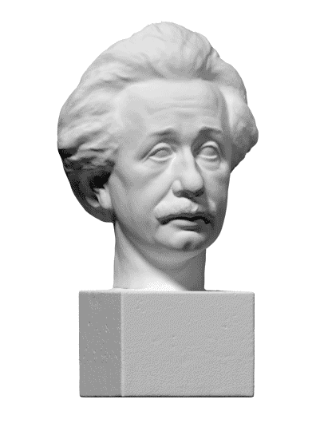
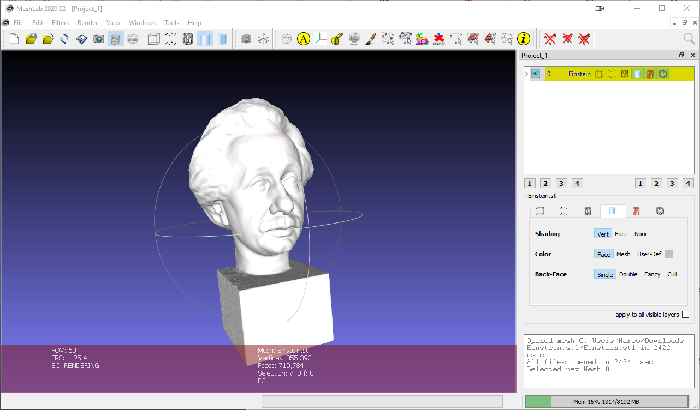
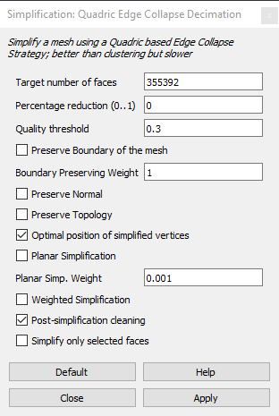
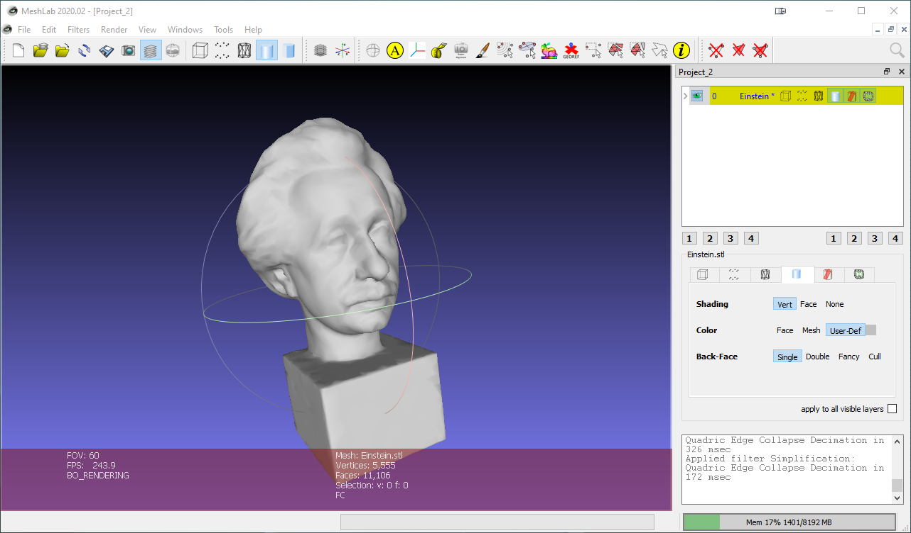
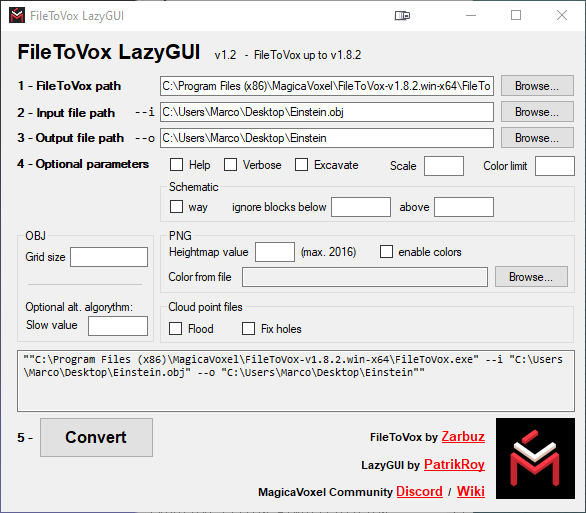
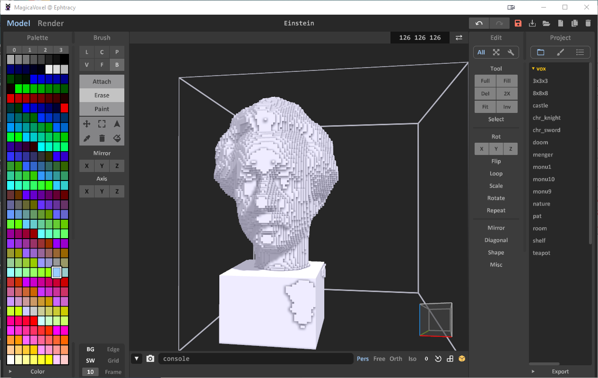

# Importing 3D Models

## 1. Importing Complex Models \(i.e.: 3D Scans\)

This is a simple workflow I use when transforming high-poly models to voxel models.

### Problem

You want to import a 3D scan model into MagicaVoxel.



### Solution

I use a 3-steps procedure:

1. Simplify the mesh through [MeshLab](http://www.meshlab.net/)
2. Create a _.vox_ model through [FileToVox](https://github.com/Zarbuz/FileToVox)
3. Open the file in MagicaVoxel

#### Simplifying the Model

**MeshLab** \([http://www.meshlab.net/](http://www.meshlab.net/)\) is an amazing open-source tool for processing and editing 3D triangular meshes. What we need here is its ability to cleanup and reduce triangle numbers.

* Download and install the software
* Open the software
* Import \(_File &gt; Import Mesh_\) the 3D mesh you need to simplify



You are now ready to simplify the model:

1. _Select, from the main menu Filters &gt; Remeshing, Simplification and Reconstruction &gt; Simplification &gt; Quadric Edge Collapse Decimation_

You will get the following simplification window:



For our purpose, we just need to decrease the number of faces

* Lower the _Target number of faces value_ \(it is usually already halved\) or use the _Percentage reducion value_ \(0 to 1\)
* Click _Apply_
* Repeat the process until you are happy with the results
* Export the mesh in your favourite format



#### Create the .vox Model

For this step you will need a command line tool called **FileToVox** \([https://github.com/Zarbuz/FileToVox](https://github.com/Zarbuz/FileToVox)\):

* Download the tool from the GitHub repository
* Unzip the package in your file system
* Execute the FileToVox command: 

  ```text
  ./FileToVox.exe --i mymodel.obj --o mymodel
  ```

Note: if you are not comfortable with the commnad line tool, you can use FileToVox-LazyGUI \([https://github.com/patrikroy/FileToVox-LazyGUI](https://github.com/patrikroy/FileToVox-LazyGUI)\).



#### Open the File in MagicaVoxel

You are now ready to open the file in MagicaVoxel.




