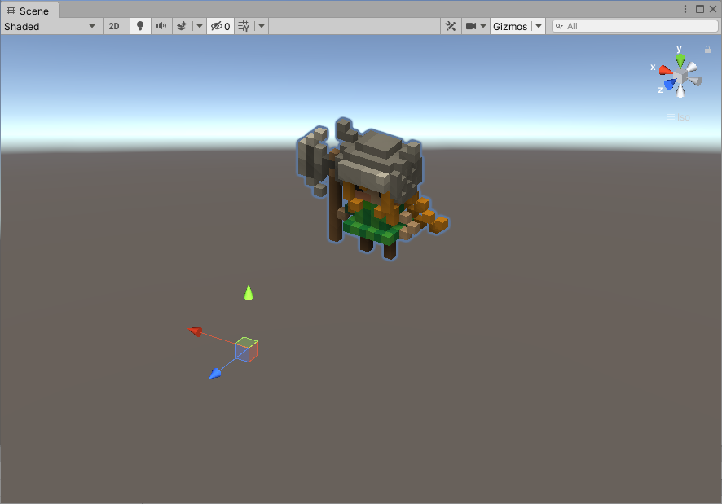

# MagicaVoxel to Unity

## 1. Wrongly Placed Pivot Point

 _MagicaVoxel Version: 0.99.4.2-alpha_

#### Problem

Exporting a _.vox_ model to _.obj_ and importing as is it in Unity will result in a weirdly placed pivot point.

#### Solution

In MagicaVoxel, before exporting the model, do the following steps:

1. Switch to _World Editor_ \(pressing the _Tab_ key or clicking the dedicated button\)
2. Open the _Move_ section in the _Edit_ column
3. Click the _Ground_ button
4. Export the _.obj_ file
5. Import it in Unity, this should fix the problem



