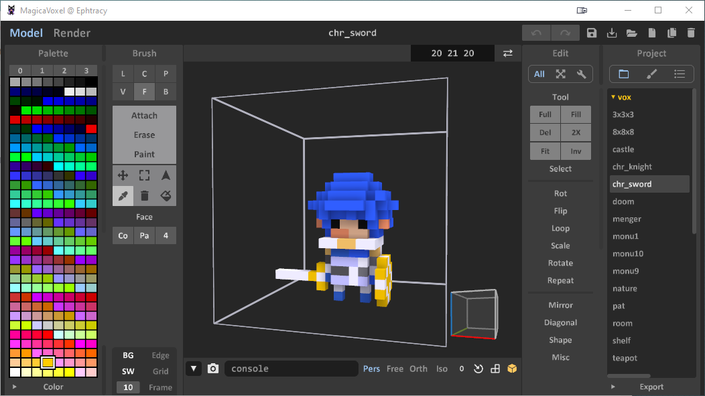
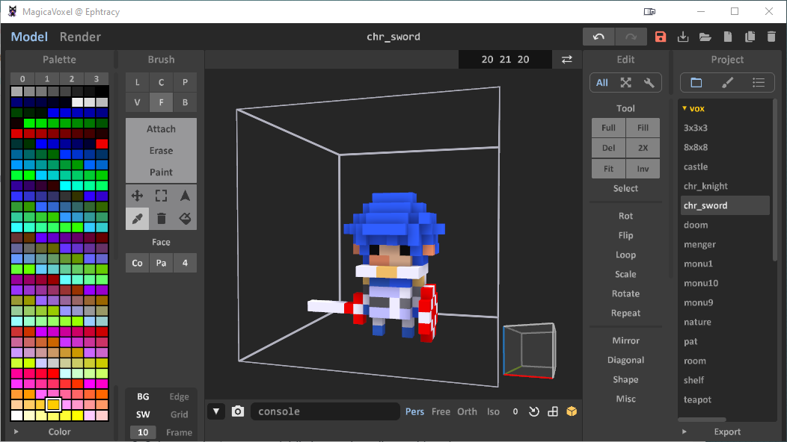

# Writing Your First Shader

To write your first shader all you need is a simple text editor: my favourite is [Visual Studio Code](https://code.visualstudio.com/), but anything will be just fine.

## Creating the File

First of all you'll have to create your shader file inside the _shader_ folder of your MagicaVoxel installation:

1. Navigate to tour MagicaVoxel executable location and open the _shader_ folder
2. Create a new text file and name it _color-replacement.txt_
3. Open the file

## Adding the Map Function

First of all we are going to add thew `map(vec3 v)` method that is going to create a voxel at position v:

```text
float map(vec3 v) {
}
```

Next we are going to retrieve  the voxel color index at position `v` : we will need this to check if the voxel color should be replaced. Let's add the following code inside the curly brackets:

```text
float index = voxel(v);
```

## Retrieving Parameters

We are now going to get a user defined parameter, that will be the new color index. Parameters are passed as an array called iArgs. Just before the closing bracket, add:

```text
float newIndex = iArgs[0];
```

The value `0` means we are getting the first element of the params array.

### Checking the Selected Color Index

We now need to check if the voxel we are checking is of the selected color in the MagicaVoxel editor. If this is true, we replace the color index \(i.e.: we return the new value\):

```text
    if(index == iColorIndex) {
        return newIndex;
    }
```

The `iColorIndex` is a built-in value indicating the actual selected color.

If the voxel is not of the needed color index, we return the old value. Add the following line just before the last closing bracket:

```text
return index;
```

### The Final Code

The complete shader code is the following:

```text
float map(vec3 v) {
    float index = voxel(v);
    float newIndex = iArgs[0];
    if(index == iColorIndex) {
        return newIndex;
    }
    return index;
}
```

Save the file and open MagicaVoxel.

### Testing the Shader

To check the shader functionality we have to simply open a voxel model and call the commend from the console:

1. Open a Voxel model \(I choose _chr\_sword_\)
2. Select a color in your model \(I choose the yellow gold one\)
3. Insert in the console the following code \(the index 36 is a bright red in the default palette 0\) and hit _Enter_:

```text
xs color-replacement 36
```

Your model should change from this:



To this:



Congratulations! You've just built your first shader.


